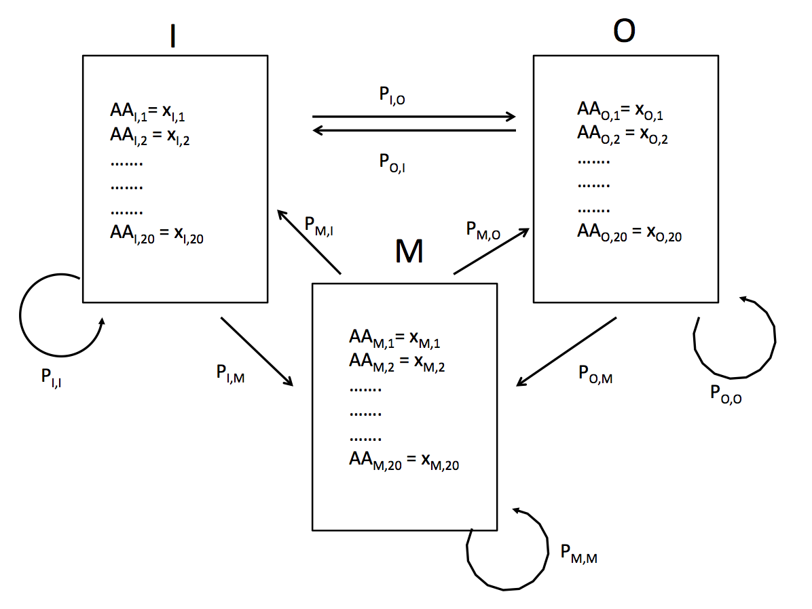

### Section 1

For ECgnfinder_mc I had very good results. For the coding test data there was 100% accuracy and 99% accuracy for the non-coding test set (i.e. almost all the time the markov model predicted whether a sequence was coding or non-coding using log-likelihood values). However, ECgnfinder was not as accurate, as it only predicted ~79% of the coding genes and ~72% of the non-coding genes, suggesting that a first-order markov chain offers a fair level of improvement over a method which relies only on likelihood.  

These results are likely artifacts of the test and training data. For the training data I used 1,000 *E. coli* genes from an annotated genome. For the test data I chose 500 coding and non-coding genes from curated datasets on NCBI. These datasets may not have the same level of diversity (i.e. there might be multiple copies of the same gene), suggesting that these datasets may not provide much of a challenge to a first-order Markov model. This model would likely fail when applied to *E. coli* genomes with very different gene content, suggesting that supplying more diverse training and test data may 

### Section 2

#### 1.

**a)** 

|   | 1 | 2 | 3 | 4 | 5 | 6 | 7  | 8 | 9  | 10 |
|---|---|---|---|---|---|---|----|---|----|----|
| A | 0 | 5 | 5 | 3 | 1 | 3 | 10 | 8 | 0  | 2  |
| C | 5 | 0 | 4 | 4 | 0 | 0 | 0  | 0 | 0  | 2  |
| G | 2 | 5 | 1 | 1 | 2 | 6 | 0  | 1 | 0  | 0  |
| T | 3 | 0 | 0 | 2 | 7 | 1 | 0  | 1 | 10 | 6  |

Which gives us a frequency matrix of

|   | 1 | 2 | 3 | 4 | 5 | 6 | 7  | 8 | 9  | 10 |
|---|---|---|---|---|---|---|----|---|----|----|
| A | 0 | 0.5 | 0.5 | 0.3 | 0.1 | 0.3 | 1 | 0.8 | 0  | 0.2  |
| C | 0.5 | 0 | 0.4 | 0.4 | 0 | 0 | 0  | 0 | 0  | 0.2  |
| G | 0.2 | 0.5 | 0.1 | 0.1 | 0.2 | 0.6 | 0  | 0.1 | 0  | 0  |
| T | 0.3 | 0 | 0 | 0.2 | 0.7 | 0.1 | 0  | 0.1 | 1 | 0.6  |

**b)**

Next we run all cells through the following formula

$$f_{i,j} = \frac{n_{i,j} + p_{i}k} {\sum_{i}^{4}n_{i,j} + p_{i}k}$$

to get the relative frequency. Here $$n_{i,j}$$ is the number of occurrences of residue i at position j, $$p_{i}$$ is the prior residue probability for residue i, $$k$$ is the pseudocount (1 here). 
Here we are adding pseudocounts according the prior frequency of each nucleotide.

This is done using the nucleotide frequencies

$$p_{A} = 37 /100 = 0.37 $$

$$p_{C} = 15 / 100 = 0.15$$

$$p_{G} = 18 / 100 = 0.18 $$

$$p_{T} = 30 / 100 = 0.3 $$

We get the following matrix

|   | 1 | 2 | 3 | 4 | 5 | 6 | 7  | 8 | 9  | 10 |
|---|---|---|---|---|---|---|----|---|----|----|
| A | 0.0336 | 0.488 | 0.488 | 0.306 | 0.125 | 0.306 | 0.943 | 0.761 | 0.0336 | 0.216 |
| C | 0.468 | 0.0136 | 0.377 | 0.377 | 0.0136 | 0.0136 | 0.0136 | 0.0136 | 0.0136 | 0.196 |
| G | 0.198 | 0.471 | 0.107 | 0.107 | 0.198 | 0.562 | 0.0164 | 0.107 | 0.0164 | 0.0164 |
| T | 0.3 | 0.0273 | 0.0273 | 0.209 | 0.664 | 0.118 | 0.0273 | 0.118 | 0.936 | 0.6  |

**c)** 

We define relative entropy as $$H(P\parallel Q) = \sum_{i}P(x_{i})ln\frac{P(x_{i})}{Q(x_{i})}$$ and we will compute the relative entropy of each position for the two matrices, where P is the original marix and Q is the matrix that incorporates prior information

| Site | H |
|:-:|---|
| 1 | 0.0351 |
| 2 | 0.0421  |
| 3 | 0.0291  |
| 4 | 0.00219  |
| 5 | 0.0167  |
| 6 | 0.0168  |
| 7 | 0.0587  |
| 8 |  0.0167 |
| 9 |  0.0661 |
|10 | -0.0114  |

**d)** 

We calculate the log-likelihood ratio for the sequence 'CAAATTATTT' using the above two models

$$\Theta_{0} = 0.5 * 0.5 * 0.5* 0.3* 0.7*0.1 * 1 * 0.1* 1*0.6 = 0.0001575$$

$$\Theta_{1} = 0.468 * 0.488*0.488*0.306 * 0.664*0.118 * 0.943 * 0.118 *0.936* 0.6 = 0.000167$$

Take the log-likelihood

$$ln\; \Theta_{0}  = ln(0.0001575) = -8.76$$

$$ln\; \Theta_{1}  = ln(0.000167) = -8.70$$

Get the likelihood ratio

$$ \frac{ln(\Theta_{1}S)}{ln(\Theta_{0}S)} = 0.993$$

So the first model is slightly more likely in this scenario. The opposite would likely be true given more test data.

#### 2.

Each box represents a hidden state, with three possible hidden states. Within each box is a set of emission probabilities. The transition probabilities are represented by arrows in the figure. Emission probabilities and transition probabilities are estimated using training data (i.e. a set of observations).The initial probability would be one.

#### 3

Using the Viterbi algorithm, we make a table 

| State | Start  |  6 | 6  | 6  | 6  |  6 |  6 |
|:-:|:-:|:-:|:-:|:-:|:-:|:-:|:-:|
| Fair  | 0  |  0.5 x 0.167 = 0.0833 | (0.0833 x 0.95 x 0.167) + (0.25 x 0.1 x 0.167) = 0.0174 | (0.115 x 0.1 x 0.167) + (0.0174 x 0.95 x 0.5) = 0.0102 | (0.0102 x 0.95 x 0.167) + (0.0522 x 0.1 x 0.167) = 0.00245 | (0.00245 x 0.95 x 0.167) + ( 0.0238 x 0.1 x 0.167) =  0.000786 | (0.000786 x 0.95 x 0.167) + (0.0108 x 0.1 x 0.167) = 0.000305 |
| Loaded  |  0 | 0.5x0.5 = 0.25  | (0.25 x 0.9 x 0.5) + (0.0833 x 0.05 x 0.5) = 0.115| (0.0174 x 0.05 x 0.5) + (0.115 x 0.9 x 0.5) = 0.0522  | (0.0522 x 0.9 x 0.5) + (0.0102 x 0.05 x 0.5) = 0.0238  | (0.00245 x 0.05 x 0.5) + ( 0.0238 x 0.9 x 0.5) = 0.0108 | (0.000786 x 0.05 x 0.5) + (0.0108 x 0.9 x 0.5 ) = 0.00488  | 

We add up the highest probability in each column

$$0.25 + 0.115 + 0.0522 + 0.0238 + 0.0108 + 0.00488 = 0.457$$

And the most likely sequence of hidden states is LLLLLL