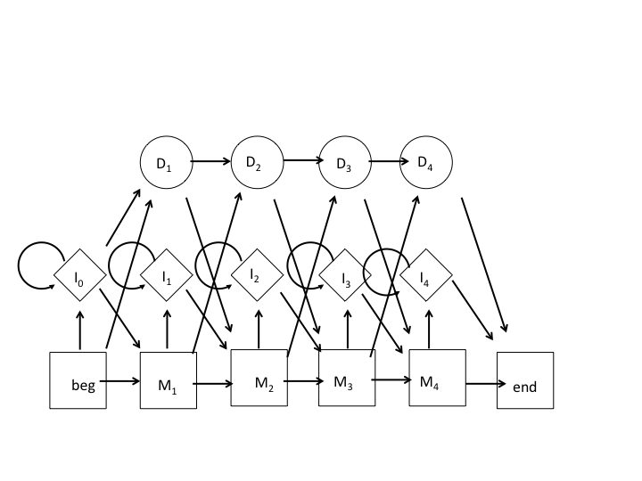

**1)**

We want the HMM to be trained progressively, switching between datasets when they're ready. For the case of two training datasets (A and B), where the model uses training set A and switches to training set B, once it is ready. 

So here the probability of a model at a given time is weighed by the probability of a given training dataset. 

The final model should be the same, as the parameters of the model were ultimately trained by both datasets, the difference is that we started with dataset A and later updated the parameters with dataset B rather than training the model with a single large assemblage of data. 

**2)**

The model is represented by the following image.

- 1) 

|   |  0 | 1  | 2  | 3  | 4 |
|:-:|---|---|---|---|---|
| A  | -  | 0  | 5   | 0  | 0  |
| C  | -  | 3  | 0   | 4  | 0  |
|  G | -  | 1  | 0   | 0  | 4  |
|  T | -  | 0  | 0   | 0  | 1  |
|  A | 0  | 0  | 0   |  4 | 0  |
|  C | 0  | 0  | 0   |  1 | 0  |
| G  |  0 | 0  | 0   |  0 | 0  |
| T  |  0 | 0  | 0   |  0 | 0  |
| M-M  | 4 | 4  | 5  |  3 | 5  |
| M-D  | 1 | 0  | 0  |  0 | 0  | 
|  M-I | 0 | 0  | 0  |  2 | 0  |
| I-M  | 0 | 0  | 0  |  3 | 0  |  
|  I-I | 0 | 0  | 0  |  3 | 0  |
| D-M  | - | 1  | 0  |  0 | 0  |
|  D-D | - | 0  | 0  |  0 | 0  |
	
- 2) First we transform the count matrix into a probability matrix. 

|   |  0 | 1  | 2  | 3  | 4 |
|:-:|---|---|---|---|---|
| A  | -  | 0  | 1  | 0  | 0  |
| C  | -  | 0.75 | 0 | 1| 0  |
|  G | -  | 0.25 | 0 | 0  | 0.8|
|  T | -  | 0  | 0   | 0 | 0.2 |
|  A |0.25|0.25|0.25|0.8|0.25|
|  C |0.25|0.25|0.25| 0.2| 0.25|
| G  |0.25|0.25|0.25|  0 |0.25|
| T  |0.25|0.25|0.25|  0 |0.25|
| M-M  |0.8|1 | 1| 0.6| 1 |
| M-D  |0.2| 0  | 0  |  0 | 0  | 
|  M-I | 0 | 0  | 0  |0.4| 0  |
| I-M |0.5| 0  |0.5|0.5|0.5|  
|  I-I |0.5| 0  |0.5|0.5|0.5|
| D-M  | - | 1  |0.5|  0 | 0  |
|  D-D | - | 0  |0.5|  0 | 0  |

Then we fill out the n x n matrix (n = length of query sequence)

|   |  0 | 1  | 2  | 3  | 4 |
|:-:|---|---|---|---|---|
|$$V^{M}_{0}$$ | 1 | 0 | 0 | 0  | 0|
|$$V^{I}_{0}$$ | 0 |0  |0  |0 |0|
|$$V^{D}_{0}$$ |  0| 0 |0  |  0 | 0 |
|$$V^{M}_{1}$$ | 0 | 0.6 |  0|  0 | 0 |
|$$V^{I}_{1}$$ | 0 |0  | 0 |   0| 0 |
|$$V^{D}_{1}$$ | 0.2 | 0 | 0 | 0  |0  |
|$$V^{M}_{2}$$ | 0 | 0.45 | 0.6 | 0 | 0 |
|$$V^{I}_{2}$$ | 0 | 0 | 0 |   0| 0 |
|$$V^{D}_{2}$$ | 0 |0  |  0|  0 | 0 |
|$$V^{M}_{3}$$ |  0|  0.45| 0.45 | 0.6  |0  |
|$$V^{I}_{3}$$ |  0|  0| 0 | 0  | 0 |
|$$V^{D}_{3}$$ |  0|  0|  0| 0  | 0 |
|$$V^{M}_{4}$$ |  0|  0| 0 |  0 | 0.96 |
|$$V^{I}_{4}$$ |  0| 0 |  0|0   | 0 |
|$$V^{D}_{4}$$ |  0|0  | 0 |  0 |  0|

Taking the most probable path, the most likely hidden state sequence of the query of "CACT" is "MMMM" with probability 0.0207.

**3)** A regular profile HMM can be generalized to incorporate domain shuffling events by calculating the log-likelihood ratio of an amino acid sequence containing a shuffling event vs. a permutated sequence. Using a set of amino acid sequences where it is known if and where the domain is shuffled as training data, we can train the model to calculate the probability that the features of a given domain (amino acid frequencies, predicted secondary structure, length, etc.) has a shuffled domain at a set of sites. From here the permutated protein sequence can be calculated as the background model and the sequence is unlikely to contain a domain shuffling event if the background model has a higher log-likelihood.

**4)**

We would need to set up two models, one for the background and one for the motif of interest. We then assign a sequence to one model or the other such that the likelihood of the data is maximized. To account for noise, we first align the reads and examine the nucleotide distribution at each site.  We assume that sequencing errors are independently placed on a read. To get the sequence we use the MEME algorithm. To estimate the error we account for the variance in nucleotide frequency at each site.

**5)**

To solve this problem we use a finite mixture model. This assumes that all the techniques have the same underlying distribution, but different parameters. So, if we know the distribution underlying the m techniques, we can estimate different false positive/ negative rates.