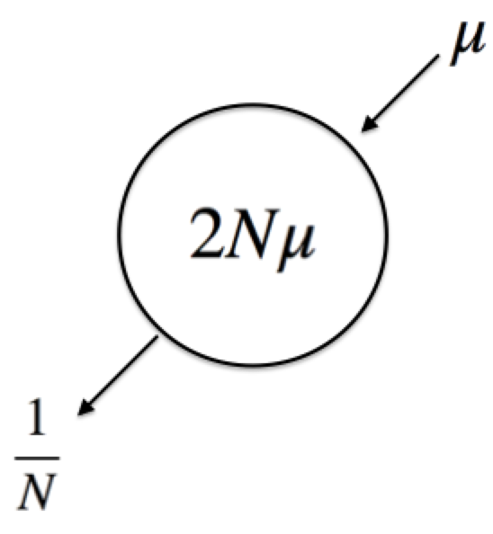
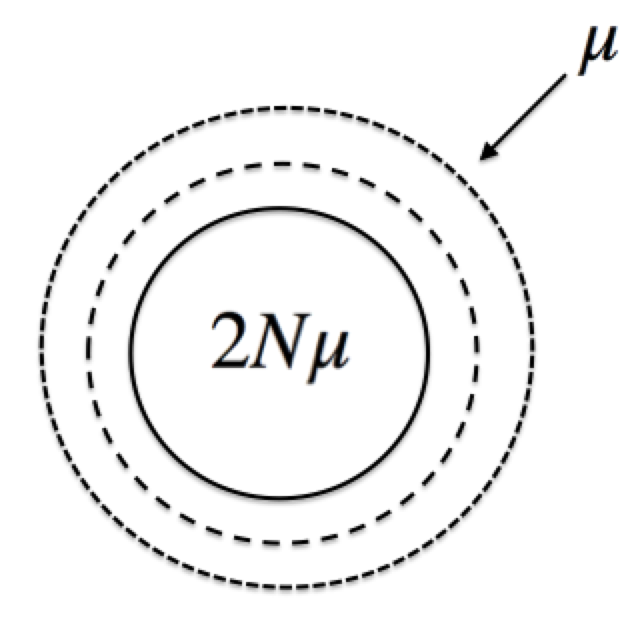

### William Shoemaker GRFP proposal 2015 

# The evolutionary implications of microbial dormancy

### Keywords: microbial seed-banks, experimental evolution, theoretical population genetics

**Background:**

Resource limitation is a critical driver of ecological and evolutionary processes in managed and natural ecosystems. When energy and nutrients are in limited supply, individuals are at risk of not being able to meet the minimum metabolic requirements to reproduce or sustain essential life-processes. As a result, many organisms have evolved life-history strategies to deal with resource limitation. In terms of sheer numbers and their central role in regulating global biogeochemical cycles, the organisms with the most diverse life-history strategies are those of microorganisms. Despite this key role, growing evidence suggests that most microorganisms are in low-resource environments and persist by entering a reversible state of reduced metabolic activity (i.e. dormancy), forming seed-banks that maintain genetic variation through time (1). 

The primary function of dormancy is to reduce the risk of population extinction when conditions are suboptimal for growth. It is well established that dormancy has strong effects on microbial physiology and community structure (2,4). While the evolutionary impact of dormancy has been assessed through recent advances in theoretical population genetics, no work has been done to test the long-term impact of dormancy on microbial evolution (3). Given that most microorganisms are in a dormant state and theory suggests dormancy having a strong impact on the evolutionary trajectory of a population, the **current lack of experimental work designed to merge natural observations and population genetic theory regarding dormancy represents a broad gap in our knowledge of microbial evolution.** 

1) Assess the evolutionary impact of dormancy through experiments that control for population demography.

2) Use an organism that has population dynamics in nature indicative of dormancy.

3) Merge data with insights from theoretical population genetics.

**Hypotheses:**

An ideal microbial population of size $$N$$ undergoing mutation at rate $$\mu$$ has a level of genetic diversity equal to $$2N\mu$$, the rate at which it is lost being the inverse of the size of the population ($$1/N$$) if all individuals are replaced by their offspring in the next generation  (Fig.1a). If we relax our assumptions and say that the population is not producing offspring, meaning that all individuals persist through time, we see that genetic diversity increases at the rate at which mutation occurs (Fig. 1b). 
Therefore, our central expectation is that a population with a pool of dormant individuals will accumulate genetic diversity more quickly than an active population, the rate of accumulation being proportional to the size of the dormant pool relative to the total size of the population. 

**Study System:**

To examine the evolutionary impact of dormancy, I will be using an environmental isolate of *Janthinobacterium*, a genus of $$\mathbf{\beta}$$-proteobacteria that has been observed in nature to exhibit dynamics typical of a population that is capable of entering dormancy(5). Our research has shown that *Janthinobacterium* exhibits unique phenotypic transitions under conditions of starvation and harbors the dormancy-associated genes cstA, sspA, and sspB5 (6). In addition, this strain is currently being used in a mutation accumulation experiment, providing a useful foundation for evolutionary inference. 

**Proposed Research:**

To ensure that dormancy is the only demography-altering process acting on the microbial populations, the experimental environment will remain in a steady-state using chemostats over the course of the experiment in M9 minimal media supplemented with 0.2% glucose. Through the use of standard culturing techniques, flow cytometry compensation beads, and the respiration-associated dye CTC (What was that dye mario was talking about?), the population size of a microbial culture can be estimated and partitioned into the metabolically active, dormant and actively dividing components. This information will  be used to adjust the chemostat dilution rate to manipulate the proportion of dormant cells across five orders of magnitude on a log 10 scale, while keeping a constant population size. Flow cytometry analyses are  currently being done through the IU Bloomington (IUB) Flow Cytometry Core Facility. Each dilution rate will have five experimental replicates. All lines will undergo pooled population sequencing using paired-end runs on an Illumina NextSeq 500 at the IUB Center for Genomics and Bioinformatics. Sequence analysis will be done using a maximum-likelihood framework to generate the site-frequency spectrum of each experimental unit. Population genetic and statistical analyses on the sequence and flow cytometry data will be done through pipelines written with the coding language Python. I will continue to use the Lennon Lab's data management policy in my research, which includes using Scholarly Data Archive for long-term data storage and version control for code development.

**Anticipated Results:**

Microbial populations that are mostly dormant are expected to have a higher level of genetic diversity than populations that are actively dividing in a steady-state system. However, there will likely be selective forces acting on populations in our experimental system, requiring the use of theoretical population genetics to infer the relative strength of adaptive and non-adaptive evolutionary forces. 

**Intellectual Merit:**

This study will merge recent developments in theoretical population genetics in a controlled environment designed to manipulate population demography. The evolutionary implications of dormancy has been well-understood in certain plants for many years. However, **dormancy has long been overlooked in microorganisms, a significant oversight given their capacity for rapid evolution and central role in the global biogeochemical cycle**

**Broader Impacts:**
As part of my public outreach I will work with the WonderLab Museum of Science, Health and Technology to engage the public on microbiology and evolution? (bad sentence)  

I will continue to disseminate my findings by making my code freely accessible through the public repository GitHub, publishing in open access journals, and presenting at academic conferences and public forums. I am currently mentoring an undergraduate and will continue to help them to develop their independent research.

Fig. 1a)

Fig. 2b) 

**Works Cited:**

1. Rittershaus, E., Baek, S. & Sassetti, C. Cell Host Microbe 13, 643–51 (2013).

2. Jones, S. E. & Lennon, J. T. Proc. Natl. Acad. Sci. U. S. A. 107, 5881–6 (2010).

3. Blath, J., Eldon, B., Kurt, N., & Wilke-berenguer, M. (2015). Genetic variability under the seed bank coalescent, 1–62.

4. Farrell, M. J., & Finkel, S. E. (2003). The Growth Advantage in Stationary-Phase Phenotype Conferred by rpoS Mutations Is Dependent on the pH and Nutrient Environment The Growth Advantage in Stationary-Phase Phenotype Conferred by rpoS Mutations Is Dependent on the pH and Nutrient Environment. doi:10.1128/JB.185.24.7044

5. Alonso-Sáez, L., Zeder, M., Harding, T., Pernthaler, J., Lovejoy, C., Bertilsson, S., & PedrÃ3s-AliÃ3, C. (2014). Winter bloom of a rare betaproteobacterium in the Arctic Ocean. Frontiers in Microbiology, 5(August), 1–9. 

6. Shoemaker, W. R., Muscarella, M. E., & Lennon, J. T.  Genome Announc 3, 10–11 (2015).

7. Lynch, M., Bost, D., Wilson, S., Maruki, T. & Harrison, S. Genome Biol. Evol. 6, 1210–8 (2014).

$$\huge \huge 2N\mu$$
