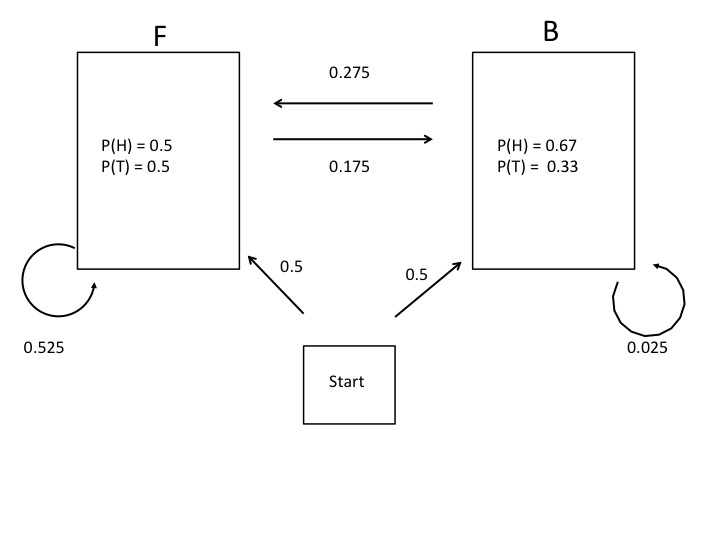

# Homework 3

### Section 1

### Section 2

1) 

2) AR-HMMs

+ 1) A standard viterbi algorithm that takes into account the hidden state as well as a subset of previous observations. From the descriptin, it should be a small modification of the k-step HMM.
	
+ 2) Here I would think that a standard Baum-Welch training algorithm could be used, with the addition of estimating the set of parameters for the long-range and short-range dependance. 

+ 3) HMMs and AR-HMMs that store the same prior number of steps should have the same number of paramters. 

3)

+ 1) I would use a HMM with a sliding window of size m. 

+ 2) Since the second tree isn't known, I would generate a null tree based off of the sequence data. The log-likelihood would then be compared with the known phylogenetic tree as the alternative hypothesis and the null phylogenteic tree as the null hypothesis.

### Section 3