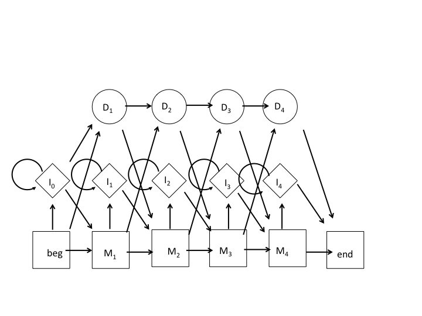

**1)**

We want the HMM to be trained progressively, switching between datasets when they're ready. For the case of two training datasets (A and B), where the model uses training set A and switches to training set B, once it is ready. 

So here the probability of a model at a given time is weighed by the probability of a given training dataset. 

The final model should be the same, as the parameters of the model were ultimately trained by both datasets, the differnece is that we started with dataset A and later updated the parameters with dataset B rather than training the model with a single large assemblage of data. 

**2)**

The model is represented by the following image.

- 1) 

|   |  0 | 1  | 2  | 3  | 4 |
|:-:|---|---|---|---|---|
| A  | -  | 0  | 5   | 0  | 0  |
| C  | -  | 3  | 0   | 4  | 0  |
|  G | -  | 1  | 0   | 0  | 4  |
|  T | -  | 0  | 0   | 0  | 1  |
|  A | 0  | 0  | 0   |  4 | 0  |
|  C | 0  | 0  | 0   |  1 | 0  |
| G  |  0 | 0  | 0   |  0 | 0  |
| T  |  0 | 0  | 0   |  0 | 0  |
| M-M  | 3 | 3  | 5  |  3 | 4  |
| M-D  | 1 | 1  | 0  |  0 | 0  | 
|  M-I | 0 | 0  | 0  |  2 | 0  |
| I-M  | 0 | 0  | 0  |  2 | 0  |  
|  I-I | 0 | 0  | 0  |  2 | 0  |
| D-M  | - | 1  | 0  |  0 | 0  |
|  D-D | - | 0  | 0  |  0 | 0  |
	
- 2)

**3)** A regular profile HMM can be generalized to incorporate domain shuffling events by calculating the log-likelihood ratio of an amino acid sequence containing a shuffling event vs. a permutated sequence. Using a set of amino acid sequences where it is known if and where the domain is shuffled as training data, we can train the model to calculate the probability that the features of a given domain (amino acid frequencies, predicted secondary structure, length, etc.) has a shuffled domain at a set of sites. From here the permutated protein sequence can be calculated as the background model and the sequence is unlikely to contain a domain shuffling event if the background model has a higher log-likelihood.
