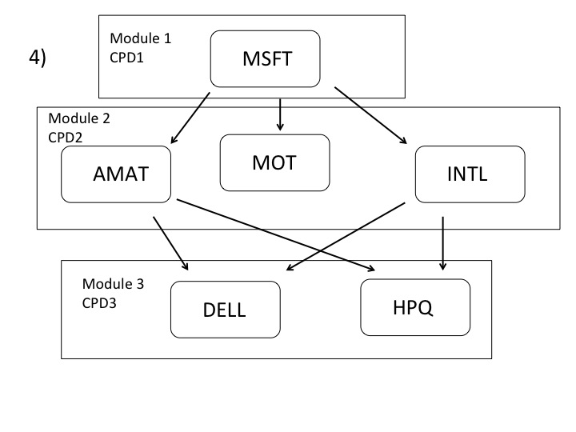
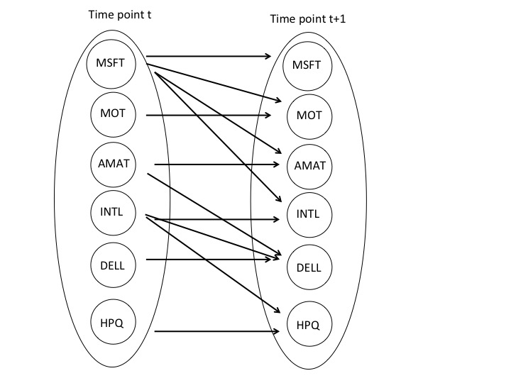
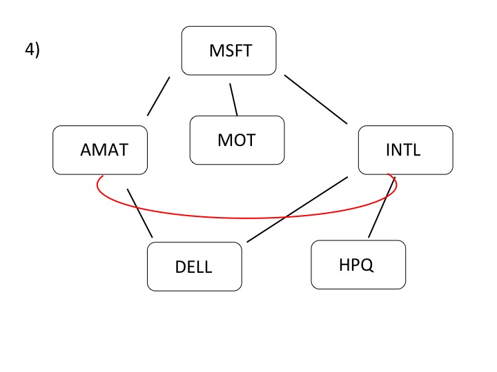

# Homework 5
### Will Shoemaker

**1)**

-1 We start with random emission symbols as a sequence and calculate the probability with our HMM.

-2 We then select a random sequence, remove the random motif and recalculate the model.

-3 Then we calculate the probability

-4 Update the model and continue iterating 

**2)**

-1 Here we have three conditional probability distributions (CPD).

 . 

-2 The module network does not represent the same dependence structure found in the original Bayesian network. This is in part due to the two addditional assumptions of modular networks. 1)  the priors of the parent nodes and the parameters of a modula are independant of the set of variables assigned to the module and 2) the prior on the module assignment function is proportional to the the product of local terms. This means that moving variables between modules does not change how we assign other variables. 

-3 A Bayesian network with a well-described distribution must be acylic, so if we take a Bayesian network and turn it into a module network we expect that it will be acylic as well.

**3)**

We should be able to just use maxmum likelihood.

 . 

**4)**

 . 

**5)**